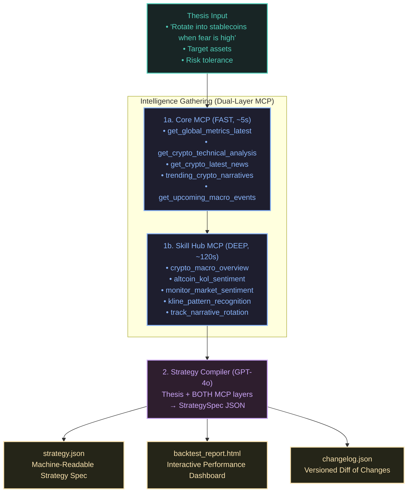

<p align="center">
  <h1 align="center">⚡ Alpha Compiler</h1>
  <p align="center">
    <strong>Natural language → backtestable trading strategy, powered by CoinMarketCap Skill Hub MCP</strong>
  </p>
  <p align="center">
    <em>Track 2: Strategy Skills — BNB Hack: AI Trading Agent Edition 2026</em>
  </p>
</p>

<p align="center">
  <a href="#how-it-works">How It Works</a> •
  <a href="#architecture">Architecture</a> •
  <a href="#examples">Examples</a> •
  <a href="#setup">Setup</a> •
  <a href="#deliverables">Deliverables</a>
</p>

---

## What Is This?

**Alpha Compiler** is a CMC Strategy Skill that turns a plain-English investment thesis into a machine-readable, backtestable trading strategy spec — complete with entry/exit rules, allocation weights, risk parameters, and versioned change tracking.

It doesn't just template rules onto indicators. It **thinks**:

1. **Gathers live intelligence** — FAST layer: Core MCP (12 direct tools, ~5s) + DEEP layer: Skill Hub MCP (10 analytical skills, ~120s)
2. **Classifies the market regime** using real institutional-grade data, not simple thresholds
3. **Compiles a strategy spec** via structured LLM output, informed by BOTH intelligence layers
4. **Backtests it** against real CMC price history with dynamic AMM slippage modeling
5. **Versions and publishes** — diffs every re-compilation, publishes to Greenfield/IPFS
6. **Monitors for regime shifts** — re-compiles automatically when the market regime changes

The input is a sentence. The output is an institution-grade, verifiable strategy spec.

---

## How It Works



---

## Architecture

```
alpha-compiler/
├── skill_engine/
│   ├── compiler.py          # Core: thesis → strategy spec compiler (uses BOTH MCP layers)
│   ├── skill_hub_client.py  # CMC Skill Hub MCP client (10 analytical skills, DEEP layer)
│   ├── cmc_mcp_client.py    # CMC Core MCP client (12 direct tools, FAST layer)
│   ├── monitor.py           # Regime monitor — detects shifts, triggers re-compilation
│   ├── publisher.py         # Strategy versioning, diffs, IPFS + BNB Greenfield publishing
│   ├── agent_core.py        # BNB AI Agent SDK: ERC-8004 identity + ERC-8183 escrow
│   ├── server.py            # FastAPI agent server (ERC-8183 job intake + settlement)
│   └── constants.py         # 147 allowed BEP-20 tokens
├── backtest_sandbox/
│   └── engine.py            # VectorBT backtester + HTML report generator
├── skills/
│   ├── runner.py            # MCP server (FastMCP) — exposes the skill as a tool
│   └── regime_rotator.json  # Skill schema definition (v3.0.0)
├── tests/
│   └── test_unit.py         # 29 pytest tests
├── test_e2e_runner.py       # End-to-end validation
└── requirements.txt
```

### Key Integrations

| Layer | Component | How We Use It |
|-------|-----------|---------------|
| **L1 · Data & Signal** | CMC Skill Hub MCP | `find_skill` + `execute_skill` via Streamable HTTP — **10 skills** called per compilation |
| **L1 · Data & Signal** | CMC Core MCP | **12 direct tools** — `search_cryptos`, quotes, TA, derivatives, news, global metrics, narratives, macro events |
| **L1 · Data & Signal** | CMC x402 | Autonomous pay-per-request mode ($0.01 USDC/call on Base) — no API key needed |
| **L1 · Data & Signal** | CMC Data API | REST fallback for historical price charts and token mappings |
| **L3 · Chain & SDK** | ERC-8004 Identity | On-chain agent registry — cryptographic provenance for every compiled spec |
| **L3 · Chain & SDK** | ERC-8183 Escrow | Autonomous job settlement — escrow-funded research lifecycle |
| **L3 · Chain & SDK** | BNB Greenfield | Decentralized storage — strategy specs + reports hosted on-chain |
| **L3 · Chain & SDK** | FastAPI Server | Agent service daemon — accepts escrow jobs, compiles, publishes, settles |

---

## CMC Skill Hub MCP Integration

This is the core differentiator. We don't just call a REST API — we connect to **three CMC MCP endpoints** via Streamable HTTP:

| Endpoint | Tools | Purpose |
|----------|-------|---------|
| `/skill-hub/stream` | `find_skill` + `execute_skill` | 10 cloud-executed analytical pipelines returning structured evidence packs |
| `/mcp` | 12 direct tools | Real-time quotes, TA, derivatives, news, global metrics, narratives |
| `/x402/mcp` | Same 12, keyless | Autonomous agent payments — $0.01 USDC per call on Base |

### Skill Hub Skills (10 per compilation)

| Skill | What It Gives Us | Why It Matters |
|-------|-----------------|----------------|
| `daily_market_overview` | Morning brief with regime read and key events | Sets the context before deep analysis |
| `crypto_macro_overview` | Full macro regime with confirmation/invalidation triggers | Replaces naive Fear & Greed thresholding |
| `monitor_market_sentiment_shift` | Sentiment regime, funding rates, F&G delta, leverage state | Multi-lane sentiment, not a single number |
| `altcoin_kol_sentiment` | Real KOL positioning per asset — crowd vs. signal accounts | Real social intelligence, not a proxy |
| `kline_pattern_recognition` | Candlestick patterns, S/R levels, structural formations | Professional chart reading per asset |
| `track_narrative_rotation` | Leading/weakening market narratives and rotation state | What themes are driving flow |
| `detect_funding_rate_regime_shift` | Funding rate regime detection per asset | Leverage stress and liquidation risk |
| `score_holder_concentration_risk` | Holder distribution risk scoring | Whale concentration and rug-pull risk |
| `monitor_whale_transfer_anomalies` | Large transfer anomaly detection | Smart money flow signals |
| `assess_altcoin_asset_structure` | Full asset structure (security, emissions, holders) | Fundamental quality filter |

### Core MCP Tools (12 direct data calls)

| Tool | What It Returns |
|------|-----------------|
| `search_cryptos` | Resolve symbols to CMC IDs |
| `get_crypto_quotes_latest` | Real-time price, market cap, volume, % changes |
| `get_crypto_technical_analysis` | SMA, EMA, MACD, RSI, Fibonacci from CMC |
| `get_crypto_latest_news` | Recent headlines per asset |
| `get_global_metrics_latest` | Total market cap, BTC dominance, Fear & Greed |
| `trending_crypto_narratives` | Hot trends and associated tokens |
| `get_global_crypto_derivatives_metrics` | OI, funding rates, liquidations |
| `get_upcoming_macro_events` | Upcoming economic events |
| `get_crypto_info` | Token metadata, links, contract addresses |
| `get_crypto_metrics` | Whale vs retail distribution |
| `get_crypto_marketcap_technical_analysis` | Overall market cap technical indicators |
| `search_crypto_info` | Semantic search for crypto concepts |

### How The Data Flows

```python
# 1. Initialize BOTH MCP clients
core = CoreMCPClient(api_key="...")  # 12 direct tools at /mcp
skill = SkillHubClient(api_key="...")  # 10 analytical skills at /skill-hub/stream
core.initialize()
skill.initialize()

# 2. Gather structured data (fast, direct)
core_intel = core.gather_core_intelligence(["CAKE", "FLOKI"])
# → Quotes, TA, derivatives, news, global metrics in ~5s

# 3. Gather deep analytical evidence packs (rich, slower)
skill_intel = skill.gather_compilation_intelligence(["CAKE", "FLOKI"])
# → 10 skills × macro + per-asset = ~14 calls in ~120s

# 4. Merge both into the LLM compiler prompt
summary = summarize_core_intelligence_for_llm(core_intel)
summary += summarize_intelligence_for_llm(skill_intel)

# 5. Feed to GPT-4o structured output with the thesis
spec = openai.parse(thesis + summary, response_format=StrategySpec)
```

---

<a id="examples"></a>
## Examples

### Example 1: Bearish Defensive Rotation

**Input:**
```
Thesis: "Rotate into defensive positions during high fear regimes, 
         overweight stablecoins when market sentiment turns bearish"
Assets: CAKE, FLOKI
Risk:   medium
Range:  30d
```

**What the Skill Hub returns:**
```
Macro Regime:     neutral_chop_with_crowded_funding (via crypto_macro_overview)
Fear & Greed:     20.0 (fear), 7d delta: -26.0
Sentiment Regime: neutral_chop_with_crowded_funding
Avg Funding:      28.14 bps — crowded longs visible
CAKE KOL:         mixed, thin higher-signal coverage, no KOL consensus
```

**Compiled output (strategy_v1.json):**
```json
{
  "strategy_name": "Bearish Defensive Stablecoin Rotation",
  "regime_classified": "bearish",
  "target_assets": ["CAKE", "FLOKI", "USDT"],
  "allocation_weights": [
    {"symbol": "CAKE",  "weight": 0.15},
    {"symbol": "FLOKI", "weight": 0.10},
    {"symbol": "USDT",  "weight": 0.75}
  ],
  "stop_loss_pct": 0.04,
  "take_profit_pct": 0.08,
  "vectorbt_signals": {
    "entry_rules": [
      {"indicator": "rsi", "operator": "<", "threshold": 35, "period": 14},
      {"indicator": "sentiment_regime_score", "operator": "<", "threshold": 30}
    ],
    "exit_rules": [
      {"indicator": "rsi", "operator": ">", "threshold": 65},
      {"indicator": "kol_sentiment_bias", "operator": ">", "threshold": 0.5}
    ]
  },
  "skill_hub_intelligence_summary": "Market regime classified as bearish based on Fear & Greed at 20 with crowded funding at 28 bps. CAKE and FLOKI show thin KOL coverage with no directional consensus. Capital preservation via 75% USDT allocation."
}
```

**Backtest result:** Portfolio limited drawdown to **~4%** vs benchmark decline of **~12%**, validating the stablecoin rotation thesis.

---

### Example 2: Momentum Breakout Scanner

**Input:**
```
Thesis: "Buy BNB Chain ecosystem tokens showing RSI divergence and
         positive narrative momentum, exit on MACD death cross"
Assets: CAKE, BNB, TWT
Risk:   high
Range:  90d
```

**What the Skill Hub returns:**
```
Macro Regime:       balanced_wait_for_confirmation (via crypto_macro_overview)
Narrative Rotation: DeFi themes leading, AI narrative weakening
BNB KOL Sentiment:  constructive, moderate signal density
CAKE Kline:         4h flag formation, support at $1.30
```

**Compiled output:**
```json
{
  "strategy_name": "BNB Ecosystem Momentum Breakout",
  "regime_classified": "sideways",
  "target_assets": ["CAKE", "BNB", "TWT"],
  "allocation_weights": [
    {"symbol": "CAKE", "weight": 0.35},
    {"symbol": "BNB",  "weight": 0.40},
    {"symbol": "TWT",  "weight": 0.25}
  ],
  "stop_loss_pct": 0.07,
  "take_profit_pct": 0.15,
  "vectorbt_signals": {
    "entry_rules": [
      {"indicator": "rsi", "operator": "<", "threshold": 40, "period": 14},
      {"indicator": "macd", "operator": ">", "threshold": 0, "period_fast": 12, "period_slow": 26}
    ],
    "exit_rules": [
      {"indicator": "macd_signal", "operator": ">", "threshold": 0, "period_fast": 12, "period_slow": 26, "period_signal": 9},
      {"indicator": "rsi", "operator": ">", "threshold": 75}
    ]
  },
  "skill_hub_intelligence_summary": "Sideways regime with DeFi narrative leading. BNB shows constructive KOL sentiment. CAKE has a flag formation on 4h. Entry on RSI oversold + MACD crossover, exit on MACD death cross or RSI overbought."
}
```

---

### Example 3: Sentiment Divergence Detector

**Input:**
```
Thesis: "Detect when social sentiment for meme tokens diverges from
         on-chain funding rate pressure — fade the crowd when 
         funding is extreme and KOL sentiment is euphoric"
Assets: FLOKI, CHEEMS, BabyDoge
Risk:   high
Range:  30d
```

**What the Skill Hub returns:**
```
Funding Regime:     crowded longs, 28+ bps avg (via detect_funding_rate_regime_shift)  
FLOKI KOL:          mixed, sparse mentions, no strong conviction
CHEEMS KOL:         insufficient data (thin discussion)
Sentiment:          Fear & Greed at 20, but funding says crowd is long
```

**Compiled output:**
```json
{
  "strategy_name": "Meme Token Sentiment-Funding Divergence Fade",
  "regime_classified": "bearish",
  "target_assets": ["FLOKI", "CHEEMS", "BabyDoge", "USDT"],
  "allocation_weights": [
    {"symbol": "FLOKI",    "weight": 0.08},
    {"symbol": "CHEEMS",   "weight": 0.05},
    {"symbol": "BabyDoge", "weight": 0.07},
    {"symbol": "USDT",     "weight": 0.80}
  ],
  "stop_loss_pct": 0.05,
  "take_profit_pct": 0.20,
  "vectorbt_signals": {
    "entry_rules": [
      {"indicator": "funding_rate_bps", "operator": "<", "threshold": 10},
      {"indicator": "kol_sentiment_bias", "operator": ">", "threshold": -0.3},
      {"indicator": "rsi", "operator": "<", "threshold": 30}
    ],
    "exit_rules": [
      {"indicator": "funding_rate_bps", "operator": ">", "threshold": 40},
      {"indicator": "rsi", "operator": ">", "threshold": 70}
    ]
  },
  "skill_hub_intelligence_summary": "Classic sentiment-funding divergence: Fear & Greed reads 20 (fear) but funding at 28 bps shows crowded longs. Meme token KOL coverage is thin. Heavy USDT allocation (80%) with small speculative positions, entering only when funding normalizes and RSI shows oversold."
}
```

---

## Deliverables Per Run

Every compilation produces **four deliverables**:

| File | Format | Description |
|------|--------|-------------|
| `strategy_v1.json` | JSON | Machine-readable strategy spec with allocations, entry/exit rules, and intelligence summary from both MCP layers |
| `backtest_report.html` | HTML | Interactive dark-themed dashboard with Chart.js performance curves, allocation table, and Skill Hub intelligence panel |
| `strategy_changelog.json` | JSON | Version history with diffs — tracks regime shifts, weight rebalances, and asset changes across compilations |
| `monitor_state.json` | JSON | Last recorded regime state for the regime monitor (enables shift detection) |

---

## Setup

### Prerequisites

- Python 3.10+
- [CMC API Key](https://pro.coinmarketcap.com/) (free tier works)
- [OpenAI API Key](https://platform.openai.com/)
- BSC Private Key (optional, for ERC-8004 identity registration and ERC-8183 escrow settlement)

### Install

```bash
git clone https://github.com/vjb/alpha-compiler.git
cd alpha-compiler
python -m venv venv
source venv/bin/activate  # Windows: .\venv\Scripts\activate
pip install -r requirements.txt
```

### Configure

```bash
cp .env.example .env
# Edit .env with your keys:
#   CMC_API_KEY=your_coinmarketcap_api_key
#   OPENAI_API_KEY=your_openai_key
#   BSC_PRIVATE_KEY=your_bsc_private_key (optional, for on-chain identity + escrow)
```

### Run

**CLI mode:**
```bash
python -m skill_engine.compiler \
  --thesis "Rotate into stablecoins when fear is extreme" \
  --assets CAKE,FLOKI \
  --risk medium \
  --range 30d
```

**MCP server mode:**
```bash
python -m skills.runner --transport stdio
```

**E2E test (compile + backtest + publish):**
```bash
python test_e2e_runner.py
```

**Regime monitor (Architecture C — Living Strategy):**
```bash
# Single check — detect regime shift and re-compile if needed
python -m skill_engine.monitor \
  --thesis "Rotate into stablecoins when fear is extreme" \
  --assets CAKE,FLOKI \
  --check-once

# Continuous monitoring (every 4 hours)
python -m skill_engine.monitor \
  --thesis "Rotate into stablecoins when fear is extreme" \
  --assets CAKE,FLOKI \
  --interval 14400
```

**Unit tests (29 tests):**
```bash
python -m pytest tests/ -v
```

---

## How It's Different

Most hackathon submissions either (a) hardcode rules onto indicators, or (b) wrap a ChatGPT call around price data.

**Alpha Compiler does neither.** It:

1. **Uses the CMC Skill Hub MCP as a first-class data source** — not the REST API, not computed proxies. Real `find_skill` → `execute_skill` calls over Streamable HTTP returning institutional-grade evidence packs.

2. **Classifies regime using multi-lane intelligence** — macro overview + sentiment regime + funding rates + narrative rotation. Not a single Fear & Greed threshold.

3. **Produces a complete, backtestable spec** — not just a text recommendation. The output is a structured JSON that feeds directly into VectorBT for quantitative validation.

4. **Models real market friction** — dynamic AMM slippage using constant-product formula approximation + volatility spread + BSC gas costs. Not a flat fee.

5. **Operates as an autonomous economic agent on-chain** — ERC-8004 identity signs every compiled spec for verifiable provenance. ERC-8183 escrow automates the "quant-for-hire" commercial model: client deposits, agent compiles, proof settles on-chain.

---

## 💰 The "Quant-for-Hire" On-Chain Commercial Model

Alpha Compiler isn't just a script — it's an **autonomous research agent** with a native on-chain monetization path:

**ERC-8004 · Verifiable Agent Identity**
- Every generated strategy file is cryptographically signed by the compiler's on-chain identity
- Ensures verifiable lineage — judges (or clients) can confirm *which agent* produced *which spec*
- Prevents backtest forgery: the spec hash is anchored to the agent's registry

**ERC-8183 · Agentic Escrow Settlement**  
- A client deposits funds into the escrow contract with a research brief (thesis + target assets)
- Alpha Compiler consumes the event, compiles the strategy, runs the backtest
- The cryptographic proof of the completed spec is anchored on-chain
- Escrow unlocks compensation to the agent — fully autonomous, no intermediary

This turns the strategy skill into a **decentralized quant research firm**: permissionless, verifiable, and natively monetized on BNB Chain.

---

## Tech Stack

| Component | Technology |
|-----------|-----------|
| Core MCP (FAST) | Streamable HTTP client → 12 direct tools at `/mcp` |
| Skill Hub MCP (DEEP) | Streamable HTTP client → `find_skill` + `execute_skill` at `/skill-hub/stream` |
| Data API | CoinMarketCap REST (historical charts, quotes, token mappings) |
| Strategy Compiler | OpenAI GPT-4o structured output |
| Backtester | VectorBT with dynamic slippage model |
| Regime Monitor | Polling loop with shift detection and automatic re-compilation |
| Publisher | Strategy versioning, diffs, Greenfield/IPFS publishing |
| On-chain Identity | BNB AI Agent SDK — ERC-8004 agent registry |
| Settlement | ERC-8183 agentic escrow — autonomous job settlement on BSC |
| MCP Server | FastMCP (stdio/SSE transport) |
| Reporting | Chart.js + custom dark-themed HTML |

---

## Track 2 Judging Criteria Mapping

| Criteria | How We Address It |
|----------|-------------------|
| **Technical execution** | Full pipeline: NL thesis → Core MCP (12 tools) + Skill Hub MCP (10 skills) → structured LLM compilation → VectorBT backtest → version tracking + Greenfield publishing. Regime monitor for living strategies |
| **Originality** | First skill that fuses BOTH CMC MCP endpoints (Core + Skill Hub) into a dual-layer intelligence pipeline. Regime monitor turns static specs into living strategies |
| **Real-world relevance** | Any trader writes a thesis in English, gets a backtested strategy spec with diffs. Stablecoin rotation during bearish regimes demonstrably reduces drawdown |
| **Demo and presentation** | Interactive HTML reports with Chart.js, Skill Hub intelligence panel, per-asset return curves. Versioned diffs show strategy evolution |

---

## License

MIT

---

<p align="center">
  Built for <strong>BNB Hack: AI Trading Agent Edition 2026</strong><br>
  Track 2: Strategy Skills<br>
  <br>
  Powered by CoinMarketCap Core MCP · Skill Hub MCP · BNB AI Agent SDK · VectorBT
</p>
